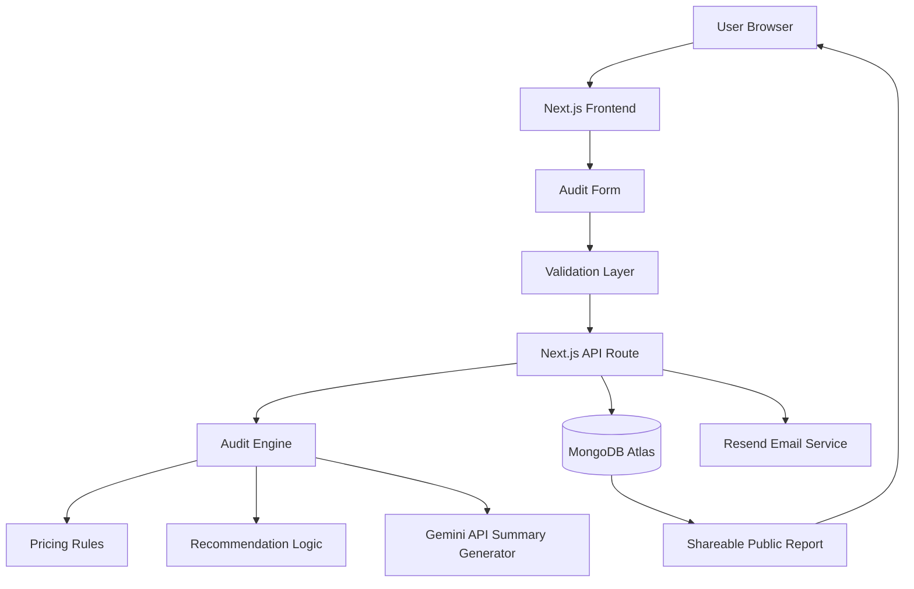

# ARCHITECTURE.md

# AI Spend Audit — System Architecture

## Overview

AI Spend Audit is a full-stack web application designed to help startups and engineering teams identify unnecessary spending on AI subscriptions and API infrastructure.

The system collects a company’s AI tooling information, evaluates pricing inefficiencies using a rule-based audit engine, generates personalized optimization recommendations, and provides a shareable audit report.

The application is optimized for:

* fast audit generation
* low friction onboarding
* clean user experience
* easy deployment
* scalable architecture for future growth

---

# System Architecture Diagram



---

# Tech Stack

| Layer         | Technology               |
| ------------- | ------------------------ |
| Frontend      | Next.js 15 + TypeScript  |
| Styling       | Tailwind CSS + shadcn/ui |
| Backend       | Next.js Route Handlers   |
| Database      | MongoDB Atlas            |
| AI Summary    | Gemini API               |
| Email Service | Resend                   |
| Deployment    | Vercel                   |
| Form Handling | React Hook Form + Zod    |
| Testing       | Vitest                   |

---

# Why I Chose This Stack

## Next.js

I chose Next.js because it provides both frontend and backend capabilities in a single framework. This reduced development complexity and allowed faster iteration during the assignment.

The App Router also made it easy to:

* generate dynamic shareable audit URLs
* handle SEO metadata
* support Open Graph previews
* deploy quickly on Vercel

Using one unified framework also simplified routing, API integration, and deployment.

---

## TypeScript

TypeScript was used to improve type safety and reduce runtime bugs, especially in:

* audit calculations
* pricing rule evaluation
* form validation
* API responses

Because the audit engine relies heavily on structured financial logic, stronger typing improved maintainability and debugging speed.

---

## MongoDB Atlas

MongoDB Atlas was chosen because:

* the application data structure is flexible
* audit documents naturally fit JSON-like storage
* rapid iteration was more important than relational modeling
* setup and deployment are fast

The application stores:

* audit reports
* user leads
* shareable audit records

without requiring complex joins or relational constraints.

---

## Tailwind CSS + shadcn/ui

This combination allowed rapid development of a modern SaaS-style UI without relying on website builders or pre-made admin dashboards.

It also helped maintain:

* accessibility
* responsive layouts
* consistent spacing
* reusable UI components

while keeping Lighthouse scores high.

---

## Gemini API

Gemini API is used only for generating personalized audit summaries.

The core financial audit logic intentionally remains deterministic and rule-based because:

* financial recommendations should be explainable
* deterministic logic is easier to test
* audit reasoning should remain transparent

AI is only used for improving readability and personalization of the final summary.

---

## Resend

Resend was selected because it provides:

* simple transactional email APIs
* clean developer experience
* fast integration
* reliable email delivery

The service is used to:

* send audit confirmation emails
* deliver report links
* support lead generation workflows

---

# Data Flow

## 1. User Input

The user lands on the audit page and fills out:

* team size
* AI tools
* plans
* monthly spend
* usage patterns
* active users
* billing preferences

The form state is persisted locally using localStorage so users do not lose progress on reload.

---

## 2. Validation

React Hook Form and Zod validate:

* required fields
* numeric ranges
* invalid combinations
* incomplete tool entries

before submission.

---

## 3. Audit Request

Once submitted:

* the frontend sends the structured audit payload
* the request reaches a Next.js API route

The backend normalizes the data before analysis.

---

# 4. Audit Engine

The audit engine evaluates:

* overprovisioned plans
* inactive seats
* duplicated tooling
* annual billing opportunities
* alternative tool recommendations
* infrastructure credit opportunities

The engine uses:

* predefined pricing datasets
* deterministic recommendation rules
* usage heuristics

Example rules:

* Team plans for 1–2 users may be excessive
* Unused seats create optimization opportunities
* Multiple coding assistants may overlap heavily

Each recommendation generates:

* reason
* recommendation
* estimated savings
* severity level

---

# 5. AI Summary Generation

After the audit completes:

* the processed audit result is sent to Gemini API
* Gemini generates a short personalized summary paragraph

If the API fails:

* the application falls back to a templated deterministic summary

This prevents broken user experiences during API outages.

---

# 6. Persistence Layer

The final audit report is stored in MongoDB Atlas.

Stored data includes:

* audit inputs
* recommendations
* calculated savings
* generated summary
* unique report ID

Sensitive user information is excluded from public report views.

---

# 7. Shareable Report Generation

Each audit receives a unique public URL:

```text
/report/[id]
```

The public report:

* removes identifying details
* preserves recommendations and savings
* supports Open Graph metadata
* enables social sharing

This creates a lightweight viral distribution loop.

---

# 8. Email Delivery

When a user requests the report by email:

* the backend stores lead information
* Resend delivers a transactional email
* the email includes the audit summary and report URL

For high-savings audits:

* the email also encourages booking a Credex consultation

---

# Scalability Considerations (10k Audits/Day)

If the application needed to handle 10,000 audits per day, I would make several architectural changes.

---

## 1. Move Audit Processing to Queue Workers

Currently, audit generation runs synchronously inside API routes.

At scale, I would:

* move audit processing into background jobs
* use queues such as BullMQ or Cloudflare Queues

This would reduce API latency and improve reliability.

---

## 2. Add Redis Caching

Pricing datasets and repeated recommendation logic could be cached using Redis to reduce repeated computation and API calls.

Caching would improve:

* response times
* infrastructure efficiency
* scalability under load

---

## 3. Separate AI Summary Service

AI generation would be isolated into its own service with:

* retry logic
* rate limiting
* async processing

This would prevent LLM latency from blocking audit generation.

---

## 4. Database Optimization

At higher scale:

* indexes would be added for audit lookups
* report retrieval paths would be optimized
* analytics pipelines would be separated from transactional traffic

Potential future migration:

* MongoDB sharding
* PostgreSQL for analytics-heavy workloads

---

## 5. Edge Caching for Public Reports

Public report pages would be cached at the CDN layer using Vercel Edge Cache or Cloudflare to reduce repeated database reads.

---

## 6. Abuse Prevention

At larger scale, I would strengthen:

* rate limiting
* bot protection
* IP throttling
* request validation
* spam filtering

to protect infrastructure costs and maintain service quality.

---

