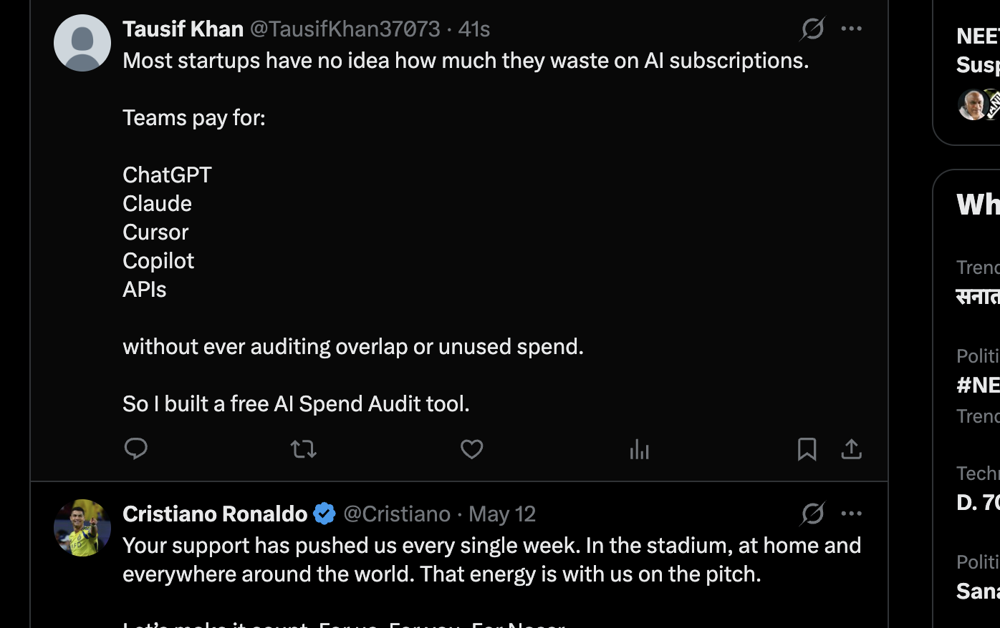
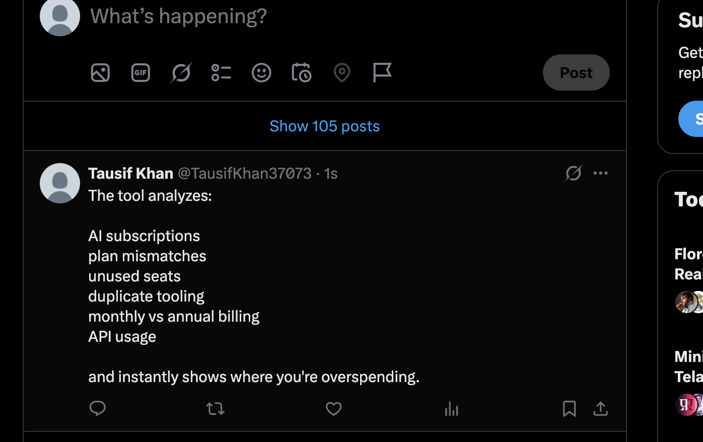
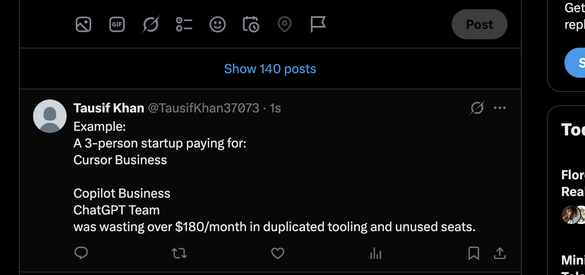
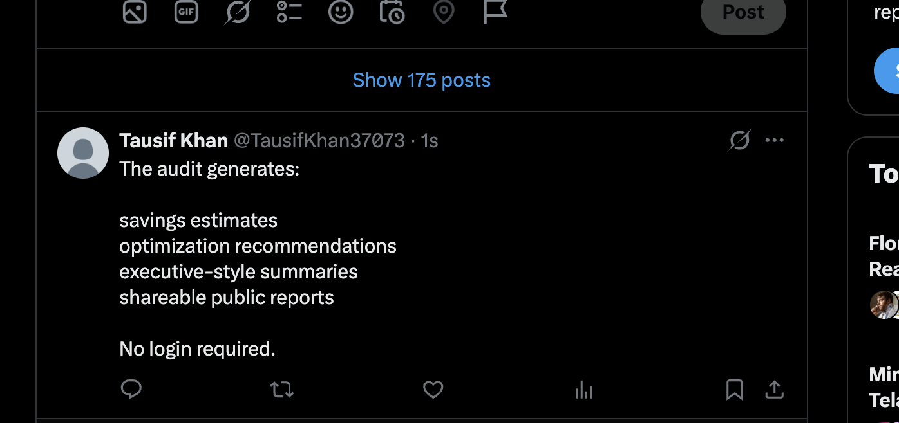
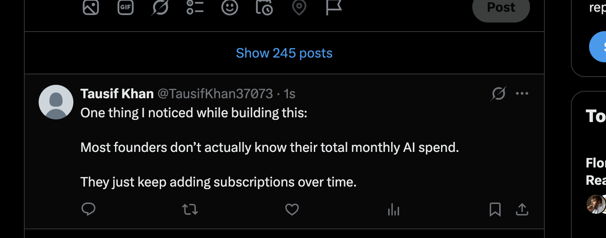
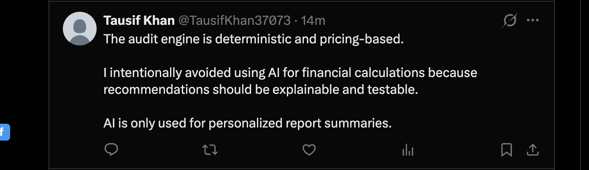
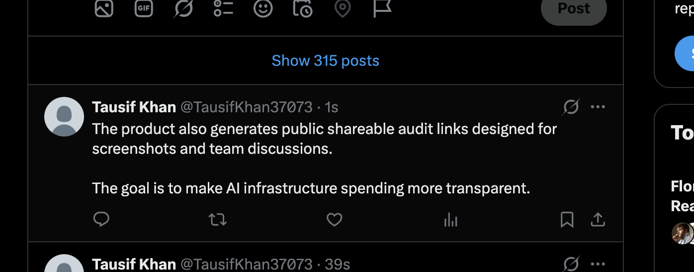

# LAUNCH_THREAD.md

## Twitter/X Launch Thread Draft

1/
Most startups have no idea how much they waste on AI subscriptions.

Teams pay for:

* ChatGPT
* Claude
* Cursor
* Copilot
* APIs

without ever auditing overlap or unused spend.

So I built a free AI Spend Audit tool.

📸 Add screenshot/image here:

---

2/
The tool analyzes:

* AI subscriptions
* plan mismatches
* unused seats
* duplicate tooling
* monthly vs annual billing
* API usage

and instantly shows where you're overspending.

📸 Add analytics screenshot here:

---

3/
Example:
A 3-person startup paying for:

* Cursor Business
* Copilot Business
* ChatGPT Team

was wasting over $180/month in duplicated tooling and unused seats.

📸 Add savings report screenshot here:

---

4/
The audit generates:

* savings estimates
* optimization recommendations
* executive-style summaries
* shareable public reports

No login required.

📸 Add generated report screenshot here:

---

5/
One thing I noticed while building this:

Most founders don’t actually know their total monthly AI spend.

They just keep adding subscriptions over time.

---

6/
The audit engine is deterministic and pricing-based.

I intentionally avoided using AI for financial calculations because recommendations should be explainable and testable.

AI is only used for personalized report summaries.

---

7/
The product also generates public shareable audit links designed for screenshots and team discussions.

The goal is to make AI infrastructure spending more transparent.

📸 Add public share page screenshot here:

