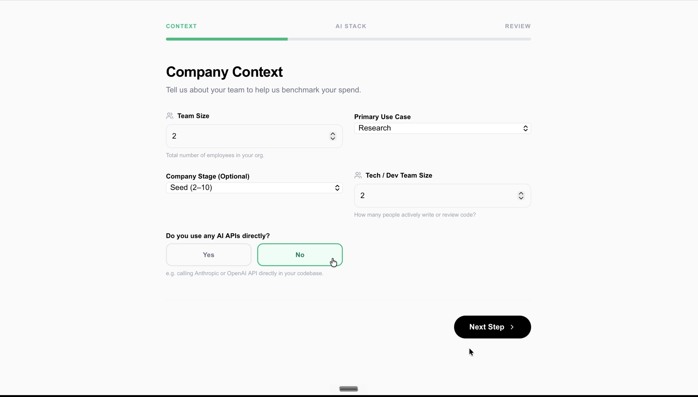
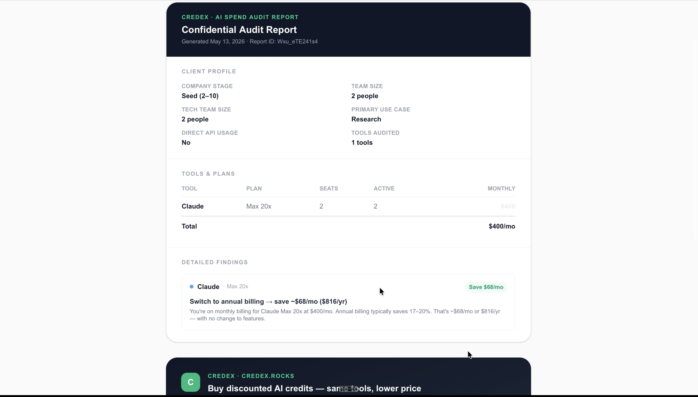
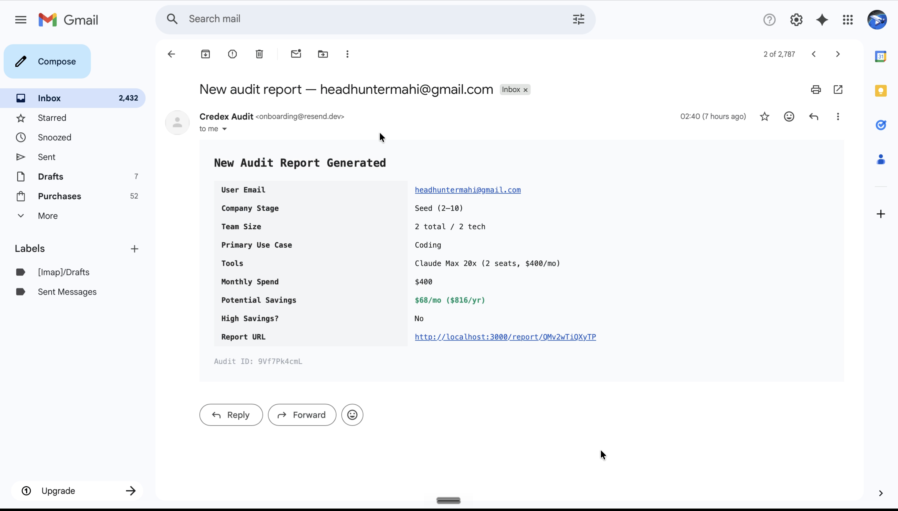

# README.md

# AI Spend Audit

AI Spend Audit is a free web application designed for startups, engineering teams, and AI-heavy workflows to analyze AI subscription spending and identify unnecessary costs. The platform audits tools like ChatGPT, Claude, Cursor, GitHub Copilot, Gemini, and API providers to generate optimization recommendations, estimated savings, and personalized audit reports.

The product is built as both:

* a useful financial optimization tool for startups
* a lead-generation system for AI infrastructure providers like Credex

Users can generate audits instantly without authentication, receive AI-generated summaries, download reports as PDFs, and share public report URLs.

---

# Live Deployment


https://ai-expense-calcy.vercel.app


---

# Demo Video


https://youtu.be/gZqtizIjhpU


---

# Screenshots

## Audit-Input Fields


(./screenshots/input-2.png)


---

## Audit Report Result



---
## Admin Email Notification



---
# Core Workflow

## 1. User Inputs AI Spending Data

The user enters:

* AI tools currently used
* subscription plans
* monthly spend
* number of seats
* active users
* billing cycle
* primary use case
* team size

Supported tools include:

* ChatGPT
* Claude
* Cursor
* GitHub Copilot
* Gemini
* OpenAI API
* Anthropic API
* Windsurf

---

## 2. Audit Engine Analysis

The backend audit engine processes the input using deterministic hardcoded rules.

The engine evaluates:

* unused seats
* duplicate tooling overlap
* plan mismatches
* annual billing opportunities
* unnecessary team plans
* savings opportunities

The engine then calculates:

* total monthly savings
* annual savings
* optimization recommendations
* high-savings lead detection

All calculations are deterministic and pricing-based rather than AI-generated.

---

## 3. AI Report Generation

After the audit engine completes its calculations, Gemini API generates a personalized 200–250 word executive-style audit report summarizing:

* current spending
* optimization opportunities
* recommendations
* next steps

If the Gemini API fails, the application falls back to a deterministic templated summary.

---

## 4. Shareable Report URLs

When the user enters their email:

* a unique public report URL is generated
* the report is stored in MongoDB
* the report can be shared publicly
* identifying details are removed from the public version

Example:

```text
/report/[reportId]
```

---

## 5. Lead Capture Workflow

When a user submits an email:

* the system sends a notification email to the configured admin email using Resend
* the notification contains:

  * user email
  * audit summary
  * report link
  * savings information

This workflow acts as a lightweight lead-generation system for high-savings audits.

---

## 6. PDF Export

Users can download and save their audit reports as PDFs using browser-native print-to-PDF functionality.

---

# Tech Stack

* Next.js 15
* TypeScript
* Tailwind CSS
* MongoDB
* Gemini API
* Resend
* Vitest
* GitHub Actions
* Vercel

---

# Quick Start

## 1. Clone Repository

```bash
git clone <your-repository-url>
cd <project-folder>
```

---

## 2. Install Dependencies

```bash
npm install
```

---

## 3. Configure Environment Variables

Create:

```text
.env.local
```

Add:

```env
MONGODB_URI=your_mongodb_uri
GEMINI_API_KEY=your_gemini_api_key
RESEND_API_KEY=your_resend_api_key
NEXT_PUBLIC_BASE_URL=http://localhost:3000
```

---

## 4. Run Locally

```bash
npm run dev
```

Application runs on:

```text
http://localhost:3000
```

---

## 5. Run Automated Tests

```bash
npm run test
```

---

# Automated Testing

The project includes automated audit engine tests using Vitest.

Test coverage includes:

* team plan overkill detection
* unused seat detection
* duplicate tool overlap detection
* annual billing optimization
* optimized stack validation
* aggregate savings calculations

Current status:

```text
12 tests passing
```

The repository also includes GitHub Actions CI which automatically runs:

* ESLint
* automated tests

on every push to the `main` branch.

---

# Decisions & Trade-Offs

## 1. Deterministic Audit Engine Instead of AI Recommendations

All pricing calculations and recommendations are generated using hardcoded backend rules to ensure recommendations remain explainable and financially defensible.

---

## 2. AI Used Only For Report Summaries

Gemini was restricted to generating readable summaries rather than financial calculations to reduce hallucinations and inconsistent recommendations.

---

## 3. Lightweight Email Infrastructure

Instead of implementing a complete production-grade outbound email system with verified domains, the MVP uses admin email notifications through Resend to demonstrate lead capture functionality quickly.

---

## 4. Browser-Based PDF Export

PDF export was implemented using browser-native print functionality instead of complex backend PDF rendering systems to reduce engineering overhead.

---

## 5. Focused Testing Scope

Testing focused primarily on the audit engine because it represents the core business logic of the product. UI-level testing was intentionally deprioritized during MVP development.

---

# Project Structure

```text
app/
components/
lib/
models/
tests/
screenshots/
public/
.github/workflows/
```

---

# CI/CD

GitHub Actions automatically runs:

* linting
* automated tests

on every push to the `main` branch.

Deployment is handled through Vercel.

---

# Author

Tausif Khan
