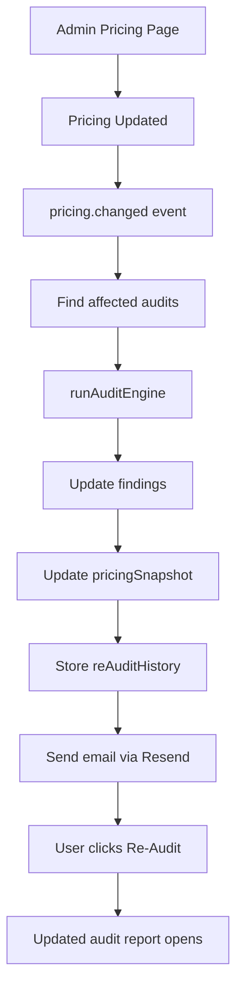

## 2026-05-20 11:00 — Start

Read assignment requirements.

Reviewed evaluation criteria and planned implementation approach before writing code.

~1 hour planning.

---

## 2026-05-20 12:00 — Architecture planning

Initial architecture designed.

Goal:

Pricing change detection → re-audit → email notification → audit comparison flow.

Decided to extend existing Round 1 architecture rather than rewrite.

---

## 2026-05-20 13:00 — Branch and project setup

Created Round 2 branch.

Created required files:

- ROUND2_PR.md
- ROUND2_DEVLOG.md
- ROUND2_REFLECTION.md

Prepared development structure.

---

## 2026-05-20 18:00 — Snapshot persistence and detection logic

Implemented:

- Pricing snapshot storage during audit creation
- Price change detection
- Plan change detection
- Audit invalidation flow

Goal:

Historical pricing comparison between old audits and current pricing.

Pushed progress to GitHub.

---

## 2026-05-20 21:00 — Re-audit notification system

Implemented:

- AI pricing change detection
- Email notification flow
- One-click re-audit email action
- Pricing history tracking
- Database history storage

Initial implementation approach:

Vercel configuration + scheduled detection.

---

## 2026-05-21 12:00 — Architecture revision

Changed architecture after identifying infrastructure limitations.

Previous:

Vercel scheduled configuration.

New approach:

Admin-controlled pricing updates + MongoDB/manual trigger detection.

Reason:

Reduced infrastructure dependency and simplified verification flow.

Implemented admin pricing management page.

---

## 2026-05-21 18:00 — Deployment

Deployed feature.

Validated production flow.

---

## 2026-05-21 20:00 — UI improvements

Improved admin pricing interface.

Polished usability and pricing update experience.

Performed final testing.