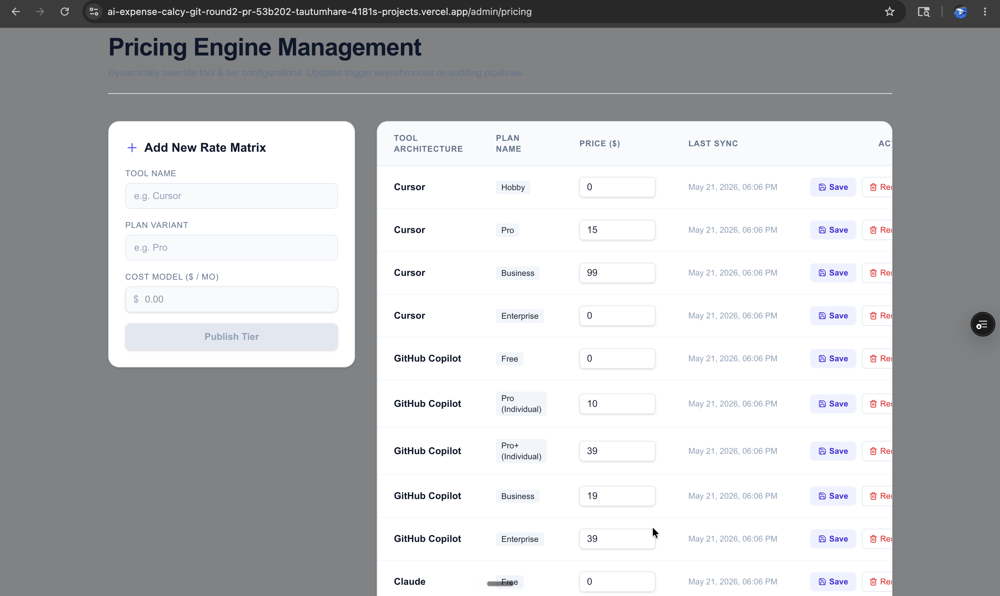
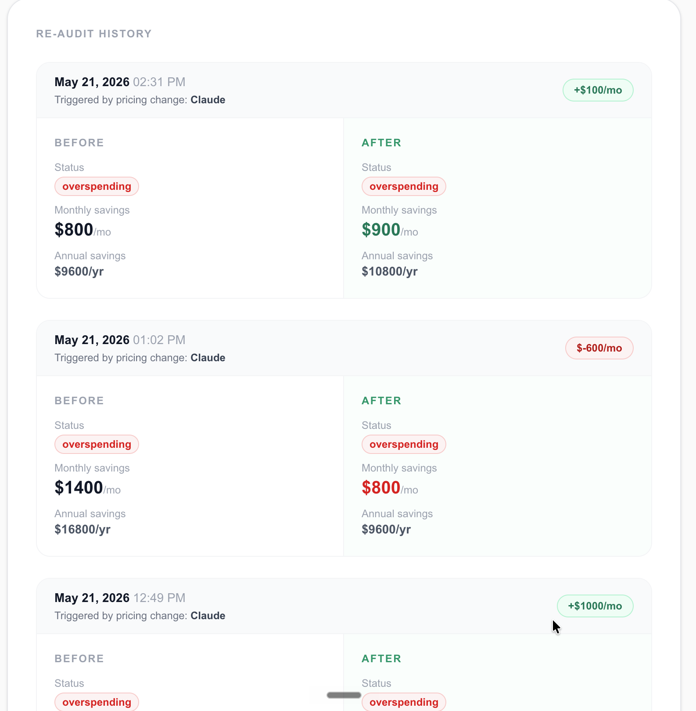
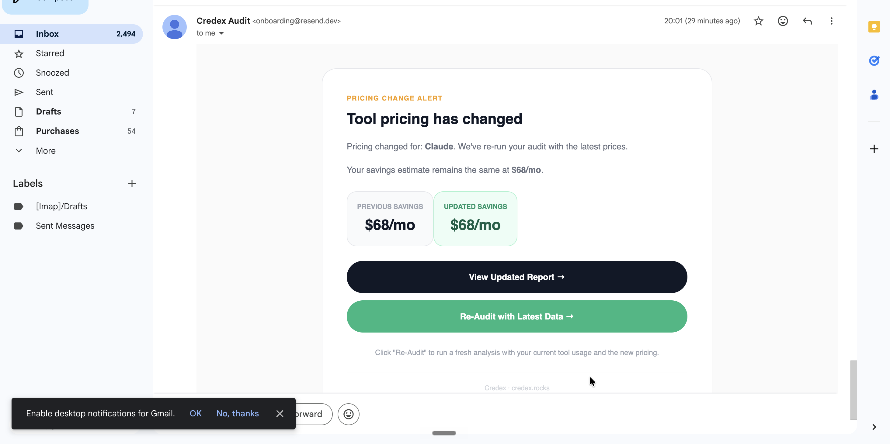

# What this PR does

This PR adds pricing-change re-audit support to the existing audit system.

Completed audits now store a pricing snapshot at creation time. When pricing changes, affected audits are recalculated automatically and email notifications are sent. Users can compare old and updated audit recommendations through the re-audit flow.

The implementation extends the existing Round 1 codebase without rewriting core audit logic.

# Why

AI tooling pricing changes frequently. Static audit recommendations become stale over time.

This feature ensures users receive updated audit recommendations when pricing changes affect their tool stack.

Assumption made:

Users care more about recommendation accuracy than historical pricing snapshots remaining unchanged forever.


# Evidence / Screenshots

The following screenshots demonstrate end-to-end functionality.

---

## 1. Admin Pricing Management

Shows pricing update interface where tool pricing is modified.

Screenshot:



Purpose:

- Update tool pricing
- Trigger pricing change detection
- Start re-audit pipeline

---

## 2. Re-Audit / Diff View

Shows previous findings compared against recalculated findings.

Screenshot:



Purpose:

- Verify audit recalculation
- Verify history tracking
- Verify pricing impact visibility

## 3. Pricing Change Email Notification

Demonstrates successful Resend email delivery after pricing changes are detected.

Screenshot:



Purpose:

- Verify email delivery
- Verify pricing detection trigger
- Verify notification pipeline

---

## How it works

```mermaid
flowchart TD

A[User submits audit]

--> B[runAuditEngine()]

--> C[Audit saved MongoDB]

--> D[pricingSnapshot stored]

E[Admin updates pricing]

--> F[pricing.changed event]

--> G[Affected audits detected]

--> H[runAuditEngine recalculates findings]

--> I[reAuditHistory updated]

--> J[Email notification via Resend]

--> K[User opens re-audit diff page]

D --> G
```
New backend pieces:

- Pricing event processor
- Pricing update API
- Re-audit history tracking
- Email notification flow

# What I cut

- Full production email domain verification flow

Reason:

Resend domain verification setup + DNS propagation was not realistic within the assignment window.

Tradeoff:

Pricing-change emails currently route to my verified email rather than dynamically sending to all audit owners.

This preserved end-to-end verification while shipping the core pricing-detection system.

- Vercel Cron

Reason:

Vercel Cron required paid infrastructure.

Moved to event-driven architecture.

# How to test manually

1. Submit an audit

2. Confirm pricingSnapshot exists in MongoDB

3. Update pricing value

Example:

Claude Max20x

200 → 250

4. Trigger pricing update

5. Verify audit recalculation

6. Verify email delivery

7. Open re-audit flow

8. Compare previous vs updated recommendations

# What's tested

- Audit persistence

- Pricing snapshot storage

- Pricing update detection

- Audit recalculation

- Email notification

- Re-audit history storage

Manual testing completed.

# Open questions / risks

- Domain verification should be completed before production rollout.

- Large audit volume would benefit from queue-based processing.

- Email retry strategy not implemented.